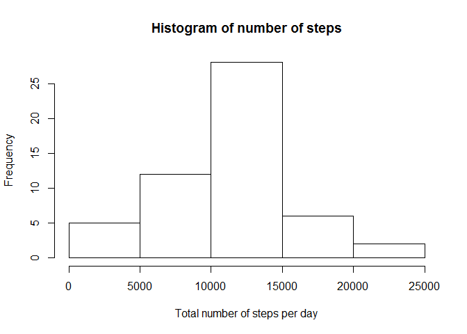
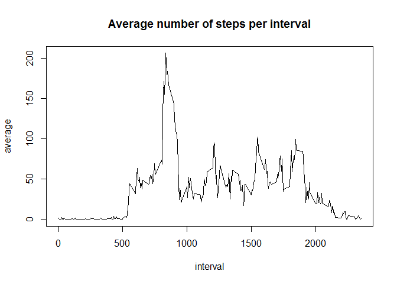
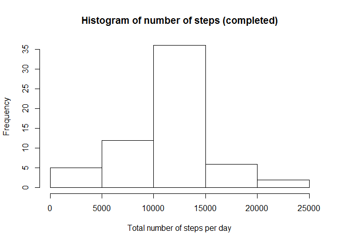
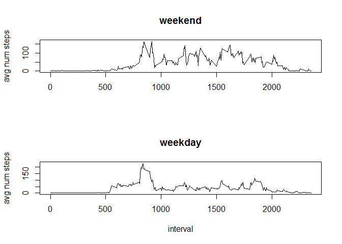

# Reproducible Research: Peer Assessment 1

This summarizes the steps taken to perform analysis in the data for the **Activity monitoring data**.  The variables cointained in this data set are: 

- **steps**: Number of steps taking in a 5-minute interval (missing values are coded as NA)
- **date**: The date on which the measurement was taken in YYYY-MM-DD format
- **interval**: Identifier for the 5-minute interval in which measurement was taken.

## Loading and preprocessing the data

We load the data that has been stored is in the local working directory. 

```r
activity<-read.csv("activity.csv")
activityN<-na.omit(activity)
activityN<-transform(activityN,interval=factor(interval))
head(activityN)
```

```
##     steps       date interval
## 289     0 2012-10-02        0
## 290     0 2012-10-02        5
## 291     0 2012-10-02       10
## 292     0 2012-10-02       15
## 293     0 2012-10-02       20
## 294     0 2012-10-02       25
```


## What is mean total number of steps taken per day?
One can see the number of steps taken ecah dayin the following histogram:

```r
stepsperday<-with(activityN,tapply(steps,date,sum))
hist(stepsperday,main=" Histogram of number of steps ",xlab = "Total number of steps per day")
```



The mean and the median number of steps is computed for each day: 

```r
Average<-with(activityN,tapply(steps,date,mean,na.rm=TRUE))
Median1<-with(activityN,tapply(steps,date,median,na.rm=TRUE))
d0<-data.frame(date=names(Average),mean=Average);
d1<-data.frame(date=names(Average),median=Median1);
mrg<-merge(d0,d1,by="date")
mrg
```

```
##          date       mean median
## 1  2012-10-01         NA     NA
## 2  2012-10-02  0.4375000      0
## 3  2012-10-03 39.4166667      0
## 4  2012-10-04 42.0694444      0
## 5  2012-10-05 46.1597222      0
## 6  2012-10-06 53.5416667      0
## 7  2012-10-07 38.2465278      0
## 8  2012-10-08         NA     NA
## 9  2012-10-09 44.4826389      0
## 10 2012-10-10 34.3750000      0
## 11 2012-10-11 35.7777778      0
## 12 2012-10-12 60.3541667      0
## 13 2012-10-13 43.1458333      0
## 14 2012-10-14 52.4236111      0
## 15 2012-10-15 35.2048611      0
## 16 2012-10-16 52.3750000      0
## 17 2012-10-17 46.7083333      0
## 18 2012-10-18 34.9166667      0
## 19 2012-10-19 41.0729167      0
## 20 2012-10-20 36.0937500      0
## 21 2012-10-21 30.6284722      0
## 22 2012-10-22 46.7361111      0
## 23 2012-10-23 30.9652778      0
## 24 2012-10-24 29.0104167      0
## 25 2012-10-25  8.6527778      0
## 26 2012-10-26 23.5347222      0
## 27 2012-10-27 35.1354167      0
## 28 2012-10-28 39.7847222      0
## 29 2012-10-29 17.4236111      0
## 30 2012-10-30 34.0937500      0
## 31 2012-10-31 53.5208333      0
## 32 2012-11-01         NA     NA
## 33 2012-11-02 36.8055556      0
## 34 2012-11-03 36.7048611      0
## 35 2012-11-04         NA     NA
## 36 2012-11-05 36.2465278      0
## 37 2012-11-06 28.9375000      0
## 38 2012-11-07 44.7326389      0
## 39 2012-11-08 11.1770833      0
## 40 2012-11-09         NA     NA
## 41 2012-11-10         NA     NA
## 42 2012-11-11 43.7777778      0
## 43 2012-11-12 37.3784722      0
## 44 2012-11-13 25.4722222      0
## 45 2012-11-14         NA     NA
## 46 2012-11-15  0.1423611      0
## 47 2012-11-16 18.8923611      0
## 48 2012-11-17 49.7881944      0
## 49 2012-11-18 52.4652778      0
## 50 2012-11-19 30.6979167      0
## 51 2012-11-20 15.5277778      0
## 52 2012-11-21 44.3993056      0
## 53 2012-11-22 70.9270833      0
## 54 2012-11-23 73.5902778      0
## 55 2012-11-24 50.2708333      0
## 56 2012-11-25 41.0902778      0
## 57 2012-11-26 38.7569444      0
## 58 2012-11-27 47.3819444      0
## 59 2012-11-28 35.3576389      0
## 60 2012-11-29 24.4687500      0
## 61 2012-11-30         NA     NA
```


## What is the average daily activity pattern?


We make a plot of the 5-minute interval (x-axis) and the average number of steps taken averaged across all days.


```r
d2<-with(activityN,tapply(steps,interval,mean))
d2<-data.frame(interval=as.integer(names(d2)),mean=d2);
plot(d2$interval,d2$mean, type="l",main="Average number of steps per interval",xlab="interval",ylab="average")
```



```r
int<-which(d2$mean==max(d2$mean))
```

The maximum is achieved on the interval 835 in the position 104 of the vector.

## Imputing missing values


```r
nm<-sum(is.na(activity))
nmd<-sum(!complete.cases(mrg))
```

The total number of missing values in the data set is 2304, but there are 8 where no data point is given.  Therefore the strategy that will be used to fill in the missing values is to replace them by the mean for the respective interval.

A new data set is created with the values filled in.


```r
Iactivity=activity
for (i in 1:nrow(Iactivity)){
    if (is.na(Iactivity[i,]$steps))
    {
       inter<-Iactivity$interval[i]
       Iactivity[i,]$steps<-d2[d2$interval==inter,]$mean
    }
}
Istepsperday<-with(Iactivity,tapply(steps,date,sum))
hist(Istepsperday,main=" Histogram of number of steps (completed) ",xlab = "Total number of steps per day")
```



```r
IAverage<-with(Iactivity,tapply(steps,date,mean))
IMedian1<-with(Iactivity,tapply(steps,date,median))
Id0<-data.frame(date=names(IAverage),mean.imputed=IAverage);
Id1<-data.frame(date=names(IAverage),median.imputed=IMedian1);
Imrg<-merge(Id0,Id1,by="date")
cmrg<-merge(mrg,Imrg,by="date")
cmrg
```

```
##          date       mean median mean.imputed median.imputed
## 1  2012-10-01         NA     NA   37.3825996       34.11321
## 2  2012-10-02  0.4375000      0    0.4375000        0.00000
## 3  2012-10-03 39.4166667      0   39.4166667        0.00000
## 4  2012-10-04 42.0694444      0   42.0694444        0.00000
## 5  2012-10-05 46.1597222      0   46.1597222        0.00000
## 6  2012-10-06 53.5416667      0   53.5416667        0.00000
## 7  2012-10-07 38.2465278      0   38.2465278        0.00000
## 8  2012-10-08         NA     NA   37.3825996       34.11321
## 9  2012-10-09 44.4826389      0   44.4826389        0.00000
## 10 2012-10-10 34.3750000      0   34.3750000        0.00000
## 11 2012-10-11 35.7777778      0   35.7777778        0.00000
## 12 2012-10-12 60.3541667      0   60.3541667        0.00000
## 13 2012-10-13 43.1458333      0   43.1458333        0.00000
## 14 2012-10-14 52.4236111      0   52.4236111        0.00000
## 15 2012-10-15 35.2048611      0   35.2048611        0.00000
## 16 2012-10-16 52.3750000      0   52.3750000        0.00000
## 17 2012-10-17 46.7083333      0   46.7083333        0.00000
## 18 2012-10-18 34.9166667      0   34.9166667        0.00000
## 19 2012-10-19 41.0729167      0   41.0729167        0.00000
## 20 2012-10-20 36.0937500      0   36.0937500        0.00000
## 21 2012-10-21 30.6284722      0   30.6284722        0.00000
## 22 2012-10-22 46.7361111      0   46.7361111        0.00000
## 23 2012-10-23 30.9652778      0   30.9652778        0.00000
## 24 2012-10-24 29.0104167      0   29.0104167        0.00000
## 25 2012-10-25  8.6527778      0    8.6527778        0.00000
## 26 2012-10-26 23.5347222      0   23.5347222        0.00000
## 27 2012-10-27 35.1354167      0   35.1354167        0.00000
## 28 2012-10-28 39.7847222      0   39.7847222        0.00000
## 29 2012-10-29 17.4236111      0   17.4236111        0.00000
## 30 2012-10-30 34.0937500      0   34.0937500        0.00000
## 31 2012-10-31 53.5208333      0   53.5208333        0.00000
## 32 2012-11-01         NA     NA   37.3825996       34.11321
## 33 2012-11-02 36.8055556      0   36.8055556        0.00000
## 34 2012-11-03 36.7048611      0   36.7048611        0.00000
## 35 2012-11-04         NA     NA   37.3825996       34.11321
## 36 2012-11-05 36.2465278      0   36.2465278        0.00000
## 37 2012-11-06 28.9375000      0   28.9375000        0.00000
## 38 2012-11-07 44.7326389      0   44.7326389        0.00000
## 39 2012-11-08 11.1770833      0   11.1770833        0.00000
## 40 2012-11-09         NA     NA   37.3825996       34.11321
## 41 2012-11-10         NA     NA   37.3825996       34.11321
## 42 2012-11-11 43.7777778      0   43.7777778        0.00000
## 43 2012-11-12 37.3784722      0   37.3784722        0.00000
## 44 2012-11-13 25.4722222      0   25.4722222        0.00000
## 45 2012-11-14         NA     NA   37.3825996       34.11321
## 46 2012-11-15  0.1423611      0    0.1423611        0.00000
## 47 2012-11-16 18.8923611      0   18.8923611        0.00000
## 48 2012-11-17 49.7881944      0   49.7881944        0.00000
## 49 2012-11-18 52.4652778      0   52.4652778        0.00000
## 50 2012-11-19 30.6979167      0   30.6979167        0.00000
## 51 2012-11-20 15.5277778      0   15.5277778        0.00000
## 52 2012-11-21 44.3993056      0   44.3993056        0.00000
## 53 2012-11-22 70.9270833      0   70.9270833        0.00000
## 54 2012-11-23 73.5902778      0   73.5902778        0.00000
## 55 2012-11-24 50.2708333      0   50.2708333        0.00000
## 56 2012-11-25 41.0902778      0   41.0902778        0.00000
## 57 2012-11-26 38.7569444      0   38.7569444        0.00000
## 58 2012-11-27 47.3819444      0   47.3819444        0.00000
## 59 2012-11-28 35.3576389      0   35.3576389        0.00000
## 60 2012-11-29 24.4687500      0   24.4687500        0.00000
## 61 2012-11-30         NA     NA   37.3825996       34.11321
```

```r
summary(cmrg)
```

```
##          date         mean             median   mean.imputed    
##  2012-10-01: 1   Min.   : 0.1424   Min.   :0   Min.   : 0.1424  
##  2012-10-02: 1   1st Qu.:30.6979   1st Qu.:0   1st Qu.:34.0938  
##  2012-10-03: 1   Median :37.3785   Median :0   Median :37.3826  
##  2012-10-04: 1   Mean   :37.3826   Mean   :0   Mean   :37.3826  
##  2012-10-05: 1   3rd Qu.:46.1597   3rd Qu.:0   3rd Qu.:44.4826  
##  2012-10-06: 1   Max.   :73.5903   Max.   :0   Max.   :73.5903  
##  (Other)   :55   NA's   :8         NA's   :8                    
##  median.imputed  
##  Min.   : 0.000  
##  1st Qu.: 0.000  
##  Median : 0.000  
##  Mean   : 4.474  
##  3rd Qu.: 0.000  
##  Max.   :34.113  
## 
```
 One can see that this has a tremendous impact on the number of steps, specially on the median values which is 0 for all other days where it not needed to ocmplete the data.


## Are there differences in activity patterns between weekdays and weekends?

We use the filled data frame but we create a new factor variable with the day of the week.

```r
Iactivity$day=weekdays(as.POSIXlt(Iactivity$date))
Iactivity$W<-rep("weekday",nrow(Iactivity))
Iactivity[Iactivity$day=="Sunday",]$W<-"weekend"
Iactivity[Iactivity$day=="Saturday",]$W<-"weekend"
Iactivity<-transform(Iactivity,W=factor(W))
gbwe<-subset(Iactivity,W=="weekend")
gbwd<-subset(Iactivity,W=="weekday")
```

We compute the average number of steps taken during the weekdays and the weekends and compare then in a plot.


```r
gbwdd2<-with(gbwd,tapply(steps,interval,mean))
gbwdd2<-data.frame(interval=as.integer(names(gbwdd2)),mean=gbwdd2);
gbwed2<-with(gbwe,tapply(steps,interval,mean))
gbwed2<-data.frame(interval=as.integer(names(gbwed2)),mean=gbwed2);
par(mfrow=c(2,1))
plot(gbwed2$interval,gbwed2$mean, type="l",main="weekend",xlab=" ",ylab="avg num steps")
plot(gbwdd2$interval,gbwdd2$mean, type="l",main="weekday",xlab="interval",ylab="avg num steps")
```


